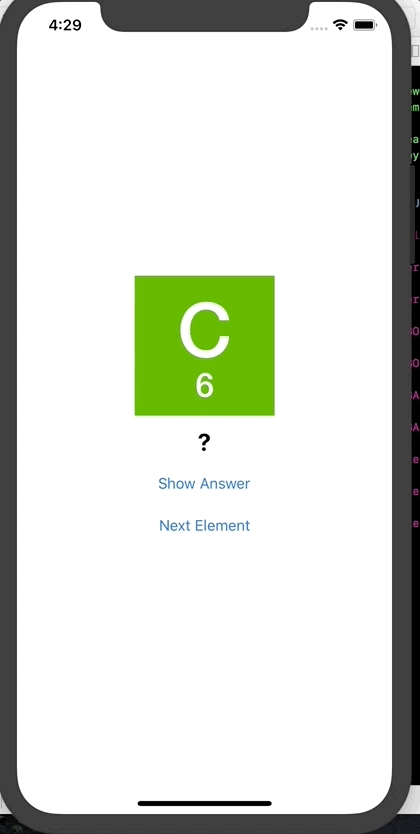

# ElementQuiz
This application quizzes users on element names.
A card shows an element with a "?" beneath it, along with a "Show Answer" button.
Users click on the "Show Answer" button and the "?" turns into the answer (the element's name).
Below that is a "Next Element" button that reveals the next card in the quiz.

To play pull down into Xcode and run on whatever device you'd like via the Simulator!
